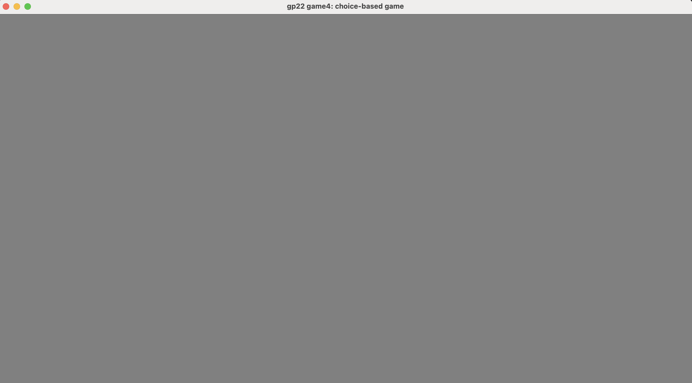

# Choice Based Text Game

Author: Kavya Tummalapalli

Text Drawing: My text drawing is rendered at runtime when given the text that it wants to print based on the the room or choice that you make. It does so by using harfbuzz to shape and get information about the glyphs and positions, using freetype to render these glyphs into their relative positions for the specific text, and then using openGL to actually draw the glyphs on the screen. I was running into openGL GL_INVALID_OPERATION errors with the glDrawArrays(GL_TRIANGLES, 0, 6) operation and thus my text was not correctly displaying.

Screen Shot:

How To Play:

Sources: Font: https://fonts.google.com/noto/specimen/Noto+Sans+Mono/about

This game was built with [NEST](NEST.md).

